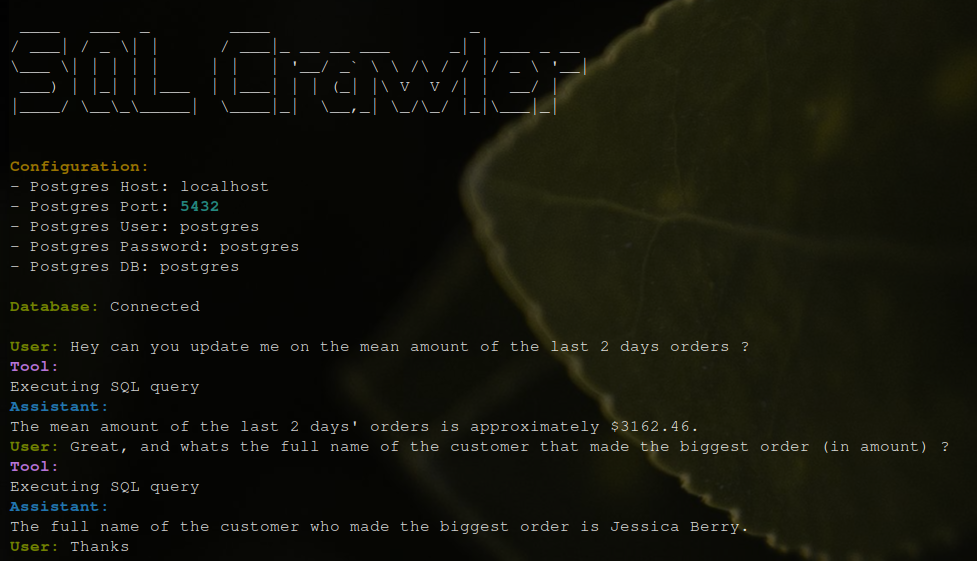

# SQLCrawler

A natural language to SQL agent built with LangGraph that enables querying databases with plain English. SQLCrawler automatically performs database discovery, executes queries, and handles follow-up questions.




## Prerequisites

- Python 3.8+
- OpenAI API key (for GPT-4o-mini model access)
- PostgreSQL database instance (or use the provided Docker setup)

## Installation

1. Clone the repository
```bash
git clone https://github.com/yourusername/SQLCrawler.git
cd SQLCrawler
```

2. Install dependencies
```bash
pip install -r requirements.txt
```

## Quick Start

### Option 1: Use your existing PostgreSQL database

If you already have a PostgreSQL database running, you can directly launch SQLCrawler:

```bash
python src/run.py
```

### Option 2: Use the provided Docker demo environment

1. Start the Docker containers (PostgreSQL + PgAdmin):
```bash
docker compose up --build
```

2. Populate the database with sample data:
```bash
python src/populate_db.py
```

3. Launch SQLCrawler:
```bash
python src/run.py
```

> **Note**: The default PostgreSQL credentials for the Docker setup are:
> - Host: localhost
> - Port: 5432
> - User: postgres
> - Password: postgres
> - Database: postgres
>
> PgAdmin is available at http://localhost:5050 with credentials:
> - Email: admin@admin.com
> - Password: admin

## Usage

Once running, interact with SQLCrawler using natural language:

```
User: What tables are in the database?
User: How many users do we have?
User: Show me the top 5 products by price.
```

Type `exit`, `quit`, or `q` to end the session.
